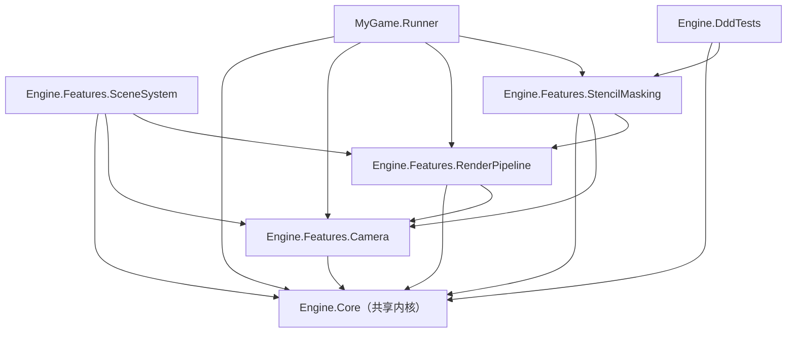

## 用户需求

将 `Engine.Features` 从**单一 csproj 项目**改造为**每个 Feature 一个独立 module project**，并为每个 Feature 建立对应的测试项目，实现垂直切片的物理隔离。

## 产品概述

- 目标结构：`Engine.Features/` 变为容器文件夹，内部每个 Feature 独立成项目（如 `Camera/Camera.csproj`），每个 Feature 旁挂测试项目文件夹（如 `Camera.Tests/`）
- 测试项目形式：采用与现有 `Engine.DddTests` 一致的可运行 Program（控制台冒烟测试），零新增 NuGet 依赖
- 目的：切面（Feature Slices）不再全部堆叠在单一 Engine.Features 项目中，降低耦合、加速增量编译、便于 AI Agent 在单个切片内工作

## 核心特性

- 4 个 Feature 独立 project：Camera、RenderPipeline、SceneSystem、StencilMasking
- 4 个测试 project：Camera.Tests、RenderPipeline.Tests、SceneSystem.Tests、StencilMasking.Tests
- 命名空间保持 `GameEngine.Features.Xxx.*` 不变，调用方代码（using）无需改动
- 删除旧 `Engine.Features.csproj`，更新 `MyGameEngine.slnx`、`MyGame.Runner`、`Engine.DddTests` 的引用

## 技术栈

- .NET 10（net10.0）+ C#，与现有项目一致
- 中央包管理（CPM，`Directory.Packages.props`）：Silk.NET 各包版本 2.22.0 集中管理
- 解决方案：`MyGameEngine.slnx`（XML 格式）

## 依赖图（已勘探确认，单向无循环）



## 实现方案

### 1. 每个 Feature 独立 csproj（源文件已就位于子目录，无需移动）

所有 feature csproj 遵循现有约定（net10.0 / ImplicitUsings / Nullable / AllowUnsafeBlocks），引用关系按依赖图配置：

| csproj | ProjectReference | Silk.NET 包 |
| --- | --- | --- |
| `Camera/Camera.csproj` | Engine.Core | 无 |
| `RenderPipeline/RenderPipeline.csproj` | Engine.Core, Camera | OpenGL |
| `SceneSystem/SceneSystem.csproj` | Engine.Core, Camera, RenderPipeline | 无 |
| `StencilMasking/StencilMasking.csproj` | Engine.Core, Camera, RenderPipeline | OpenGL |


csproj 模板（以 Camera 为例）：

```xml
<Project Sdk="Microsoft.NET.Sdk">
  <PropertyGroup>
    <TargetFramework>net10.0</TargetFramework>
    <ImplicitUsings>enable</ImplicitUsings>
    <Nullable>enable</Nullable>
    <AllowUnsafeBlocks>true</AllowUnsafeBlocks>
    <RootNamespace>GameEngine.Features.Camera</RootNamespace>
  </PropertyGroup>
  <ItemGroup>
    <ProjectReference Include="..\..\Engine.Core\Engine.Core.csproj" />
  </ItemGroup>
</Project>
```

### 2. 每个 Feature 一个可运行 Program 测试项目

- 每个 `Xxx.Tests/` 文件夹下 1 个 csproj（OutputType=Exe）+ 1 个 Program.cs，风格与现有 Engine.DddTests 一致
- 测试内容聚焦**无需 GL 上下文即可运行**的纯逻辑：
- Camera.Tests：Camera2D 平移/缩放矩阵、震屏计时
- RenderPipeline.Tests：ViewportRect.ToPixels、BlendState/DepthStencilState 值对象工厂
- SceneSystem.Tests：RenderCommand 数据、Layer 构造与排序
- StencilMasking.Tests：StencilMaskState 工厂、ApplySpotlightMaskCommand 数据链路
- ProjectReference 传递依赖（Engine.Core/Camera/RenderPipeline）由编译系统自动带入，无需显式引用

### 3. 消费者与解决方案更新

- `MyGame.Runner.csproj`：引用 Engine.Core + Camera + RenderPipeline + StencilMasking
- `Engine.DddTests.csproj`：引用 Engine.Core + StencilMasking
- `MyGameEngine.slnx`：移除 `src/Engine.Features/Engine.Features.csproj`，加入 8 个新项目
- 删除 `src/Engine.Features/Engine.Features.csproj` 及残留 `obj/`、`bin/` 目录

## 实施说明

- **性能/隔离收益**：拆分后增量编译只触发变更 Feature 及其下游，Camera（无 Silk.NET 依赖）可独立构建
- **Blast radius 控制**：不移动任何源文件、不修改命名空间、不改变行为；仅新增 csproj 与 Program.cs、更新引用配置。`SceneRenderContext`（已 [Obsolete]）原样保留在 SceneSystem 中
- **验证**：`dotnet build` 全绿 + 运行 5 个 Tests Program（Engine.DddTests 沿用）确认无回归

## 目录结构

```
src/
├── Engine.Core/                       # [不变] 共享内核
├── Engine.Features/                   # 容器文件夹（不再是 project）
│   ├── Camera/
│   │   ├── Camera.csproj              # [NEW] 独立 Feature 项目
│   │   └── Domain|Application/        # [不变] 现有源文件
│   ├── Camera.Tests/
│   │   ├── Camera.Tests.csproj        # [NEW] 可运行 Program 测试项目
│   │   └── Program.cs                 # [NEW] Camera2D 矩阵/震屏冒烟测试
│   ├── RenderPipeline/
│   │   ├── RenderPipeline.csproj      # [NEW] 引用 Engine.Core + Camera + Silk.NET.OpenGL
│   │   └── Domain|Infrastructure/     # [不变] 现有源文件
│   ├── RenderPipeline.Tests/
│   │   ├── RenderPipeline.Tests.csproj# [NEW]
│   │   └── Program.cs                 # [NEW] 值对象/ViewportRect 测试
│   ├── SceneSystem/
│   │   ├── SceneSystem.csproj         # [NEW] 引用 Engine.Core + Camera + RenderPipeline
│   │   └── Domain|Infrastructure/     # [不变] 现有源文件（含 [Obsolete] SceneRenderContext）
│   ├── SceneSystem.Tests/
│   │   ├── SceneSystem.Tests.csproj   # [NEW]
│   │   └── Program.cs                 # [NEW] RenderCommand/Layer 测试
│   ├── StencilMasking/
│   │   ├── StencilMasking.csproj      # [NEW] 引用 Engine.Core + Camera + RenderPipeline + Silk.NET.OpenGL
│   │   └── Application|Domain|Infrastructure/  # [不变] 现有源文件
│   ├── StencilMasking.Tests/
│   │   ├── StencilMasking.Tests.csproj# [NEW]
│   │   └── Program.cs                 # [NEW] StencilMaskState/命令链路测试
│   └── Engine.Features.csproj         # [DELETE] 删除，并清理 obj/、bin/
├── MyGame.Runner/                     # [改] 更新 ProjectReference
└── Engine.DddTests/                   # [改] 更新 ProjectReference
```

## 关键代码结构

无新增公共 API，仅工程配置变更。核心约束是依赖方向单向（Features → Core，Feature 间 Camera 为最底层），已通过勘探确认无循环依赖。