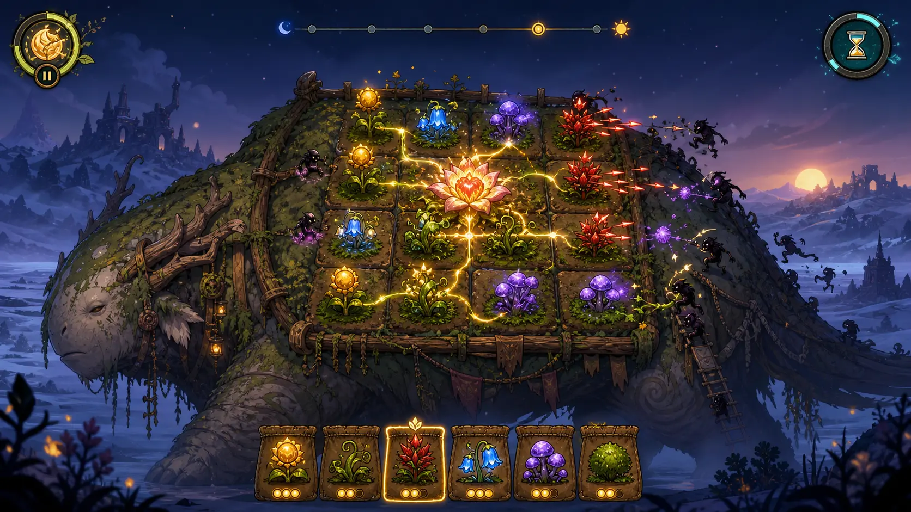

# 《驮春 / Bloomback》游戏愿景

> 状态：概念记录，尚未立项开发。名称、规则与美术均可在未来验证后调整。

## 一句话卖点

> 在最后一只迁徙巨兽背上，种出一座会自己战斗的花园，护送它穿过 15 分钟的永夜。

《驮春》不是把现有割草、塔防或 Roguelite 玩法简单拼接。它希望重新组合这些经典玩法中长期有效的部分：低操作门槛、清晰空间关系、持续成长、连锁奇观、守护情感和立即重开的短局循环。

玩家构筑的不是一列抽象数值，而是一座能够被看见、理解和记住的花园。



这张图用于讨论巨兽轮廓、背部棋盘、植物邻接、敌人攀爬和最小 HUD。它不是最终游戏截图，也不代表已经存在对应 Runtime。

## 世界幻想

漫长寒夜吞没了大部分土地。最后一只仍能迁徙的温顺巨兽背负着少量沃土，沿着旧世界遗留的道路寻找晨光。玩家不是直接战斗的英雄，而是照料这座移动花园的无形园丁。

巨兽既是关卡，也是需要守护的角色：

- 它的背部形状决定本局可种植区域。
- 行走、受伤与疲劳改变花园的状态和节奏。
- 敌人从身体两侧攀爬，首先破坏边缘植物和根系。
- 抵达晨光时，玩家看到的是自己亲手保留下来的花园。

整体气质采用“温暖奇幻中的危险”：巨兽与植物可爱、柔软、值得保护；外部世界寒冷、幽暗而空旷。危险可以紧张，但不依赖血腥或惊吓。

## 四个核心支柱

### 守护经营

失败不只是一个抽象基地数字归零，而是巨兽受伤、植物休眠、花园逐渐失去活力。玩家应当对守护对象产生感情，同时能够通过重建根系挽救局面。

### 植物邻接组合

每株植物只掌握少量通用规则：生产、传递、消费、盛放、响应邻居和保护。深度来自空间组合，而不是大量隐藏的两两合成配方。

```text
生产养分
  → 根系传递
  → 防御植物充能
  → 植物盛放
  → 授粉、孢子或荆棘响应
  → 形成可见的生态连锁
```

一束养分沿根系穿过花园、数株植物依次盛放并击退怪群，应当成为最重要的玩法高潮和传播画面。

### 实时迁徙与可控减速

巨兽持续前进，经营与袭击不完全分离。玩家选中种子、准备移栽或检查影响范围时可以让时间减速，但世界不会因此失去旅途感。

### 纯指针园艺

核心操作只有播种、移栽、收获和路线选择，不要求玩家同时操纵一个战斗角色。输入以逻辑 Pointer/Action 表达，键鼠优先，同时为未来触控和手柄保留语义边界。

## 初始植物设想

第一版概念只需要少量可读规则，不应一开始制作几十种植物。

| 植物 | 基础作用 | 空间意义 |
|---|---|---|
| 向日芽 | 周期产生养分 | 经济起点 |
| 藤脉 | 把养分传向更远邻居 | 扩展根系网络 |
| 荆棘花 | 消耗养分向指定方向发射尖刺 | 方向性防御 |
| 孢子菇 | 邻居盛放时释放范围孢子 | 连锁响应 |
| 露铃 | 加速相邻植物的下一次盛放 | 节奏放大 |
| 苔甲 | 保护格子、植物和根系 | 防止一次突破造成全局崩溃 |

养分流向、有效邻居、攻击方向和即将触发的盛放必须直接画在世界中，不能要求玩家依赖长篇说明或反复查表。

## 十五分钟目标局

一次迁徙有明确终点，不采用无限生存作为首要结构。

| 时间 | 预期体验 |
|---|---|
| 0～2 分钟 | 建立第一条养分链，认识巨兽和基础种植。 |
| 2～5 分钟 | 小型攀爬者出现，理解方向防御和边缘风险。 |
| 约 5 分钟 | 第一次迁徙路线选择，并获得植物三选一。 |
| 5～9 分钟 | 天气或地形开始改变部分格子的条件。 |
| 约 9 分钟 | 精英敌人攻击关键根系节点，要求移栽和修补。 |
| 9～12 分钟 | 花园成型，开始产生大规模连锁反应。 |
| 12～15 分钟 | 永夜高潮，玩家保护巨兽抵达晨光。 |

这个节奏只是未来原型的验证假设，不是已经平衡完成的关卡表。

## 种袋与局外成长

玩家在一局开始前配置一个小型种袋，表达计划；迁徙途中再通过三选一获得新植物或改变当前构筑。随机性应迫使玩家适应，而不是用坏运气否定空间策略。

局外成长以横向解锁为主：

- 新植物和生态流派。
- 不同巨兽特性与背部地形。
- 新迁徙路线、天气和敌人。
- 花园装饰、巨兽外观与世界图鉴。

不以永久提高基础伤害和生命值作为主要留存手段。未来可以使用 MyGameEngine 的确定性随机和 Replay 能力生成每日迁徙挑战，但当前不为此实现游戏代码。

## 为什么可能形成传播

不能设计出一个必然的“爆款”，只能提高玩家理解、记忆、分享和重玩的概率。《驮春》的潜力假设是：

- 一句话和一张图能够讲清“在巨兽背上种战斗花园”。
- 花园从稀疏到繁盛提供清晰的局内成长。
- 连锁盛放适合短视频、直播高潮和失败复盘。
- 每局布局是玩家自己的作品，适合保存花园剪影或分享构筑。
- 低操作压力扩大可达玩家范围，空间决策保留高手深度。
- 巨兽与植物提供比抽象塔防核心更强的情感连接。

## 主要风险

- 自动战斗可能退化为旁观；播种、移栽、资源和路线必须持续产生有效决策。
- 邻接规则可能难以理解；预览、根系流动和因果反馈必须优先于特效数量。
- 关键节点损坏可能导致不可逆雪崩；植物应先休眠或断连，给玩家修复机会。
- 侧视棋盘可能被巨兽和背景干扰；交互层级必须保持稳定、清晰。
- 系统容易过早膨胀；水分、季节、土壤、基因和复杂天气不能同时进入首个验证。
- Roguelite 词条可能取代花园布局；空间构筑必须始终是力量的主要来源。

## 未来原型唯一要回答的问题

如果未来正式立项，第一个原型不负责证明内容量、商业化、完整美术或 Android 发布。它只回答：

> 只靠播种和移栽，玩家能否亲手构筑出一次看得懂、意料之外、并且想再试一次的植物连锁？

在这个答案明确之前，不应先建设完整技能系统、局外存档、大型 UI、复杂光照或平台移植。

## 当前非目标

- 不创建游戏项目、Scene、Prefab 或 Content Package。
- 不实现植物、敌人、棋盘、路线、UI、存档或光照。
- 不把概念需求提前固化为 MyGameEngine 通用 API。
- 不承诺发布日期、售价、内容规模或移动端版本。
- 不改变 MyGameEngine 当前引擎路线的优先级。
