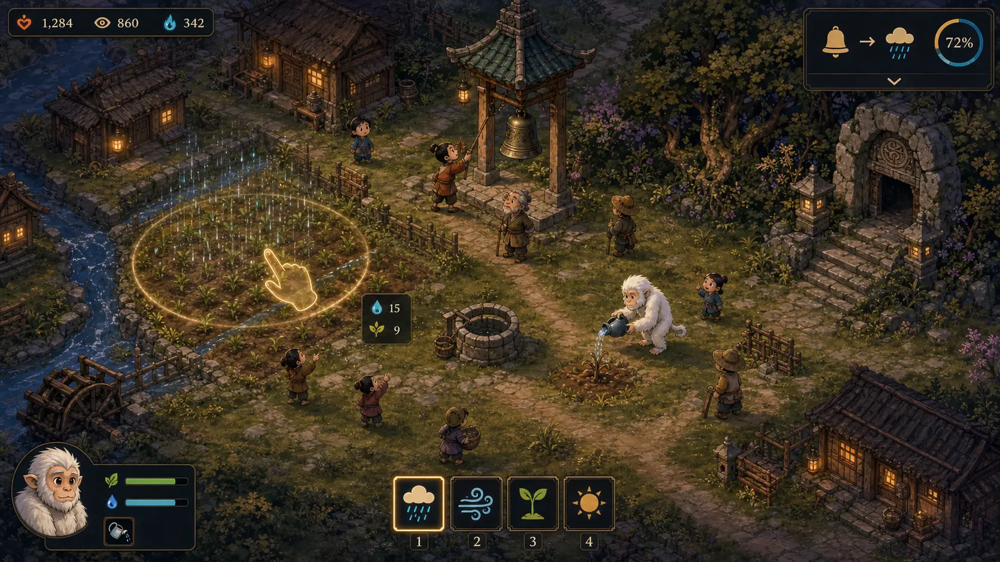

# 《神意难测 / The God They Made》

> 状态：Gate 3 神兽学习已完成，正在进入 Gate 4 完整《鸣钟谷》；尚未进入正式内容制作。

《神意难测》是一款俯视角 2D 上帝游戏：玩家扮演一位无法直接说话的小神，通过有限的神迹影响村落；村民会观察事件、推断因果并形成可能正确、也可能荒诞的信仰；一只守护神兽则会从玩家和村民的行为中学习。

游戏的核心不是在菜单里选择“善良”或“邪恶”，而是面对一个会解释玩家行为的世界：玩家可以纠正误解、利用误解，或逐渐成为村民想象中的那位神。



这张概念稿用于确定俯视角游戏尺度、钟塔与农田的空间关系、局部神迹范围、村民观察、猿形神兽和克制 HUD 的画面方向。它不是引擎截图或正式美术资产；图中的四个神迹按钮属于未来视觉探索，首个可玩原型仍只实现局部降雨。

当前目录已经建立无窗口 Simulation、可运行 Game 与 Simulation Tests 三个项目，并进入首个 10 分钟验证的工程阶段。当前画面仍使用单色占位资源，不代表正式美术、完整神迹、信仰或神兽学习已经实现。

## 当前可运行能力

- 48×32 声明式《鸣钟谷》Tilemap 和 Content Package。
- Camera 平移、滚轮缩放、世界 Cell Hover、Pointer Press/Drag/Release 与捕获。
- 点击水闸巨石可解除阻挡并递增 Navigation Revision。
- 点击世界 Cell 可把最终落点转换成固定 Tick 的局部降雨命令；神意消耗与 45 秒恢复、水库、水闸、水渠以及三块田地湿度均由无窗口 Simulation 驱动。
- 钟声、降雨开始/结束、作物枯萎/恢复和水闸打开会形成单调 ID 的 `WorldObservation`；12 名村民仅按 Visual/Auditory/Direct 范围与 Bresenham 视线记录实际感知，个人记忆上限为 32 条。
- 八条首岛因果白名单会把个人观察转换成 `-1000..1000` 的整数假说；支持、窗口超时反证、岑伯/眠婆 Prior、有界容量、午间证言和公共教义均保持确定性。
- 信仰不是只读数值：钟声召雨达到阈值后会改变第二轮敲钟、钟塔维护和教义集会任务。
- 游戏侧确定性四方向 A*、稳定破局、复用 Path Buffer 和预热后零分配查询。
- 12 名村民按 600 秒日程执行工作、集会和归家，并按脚底 Y 排序。
- 猿形神兽使用七种按优先级分类的态势、六个候选动作和身体/Affordance 硬过滤；表格型整数 Q 学习支持示范、Q/E 嘉许与制止、环境奖励、失败冷却和固定种子受控探索。
- 神兽最近 16 次选择/价值更新组成可解释梦境数据；Q 表、冷却、信赖、随机状态和解释环均可 Capture/Restore，恢复后的下一次选择严格一致。
- `--smoke` 隐藏窗口入口，以及不依赖 GPU 的 Simulation 测试。
- `--scripted-belief --record-replay <file>` 与 `--scripted-belief --replay <file>` 会通过真实 Replay Bundle 逐 Tick 复现固定信仰脚本、神兽示范/搬运/奖励和 Gameplay State Hash。

```powershell
dotnet run --project games/TheGodTheyMade/src/TheGodTheyMade.Game/TheGodTheyMade.Game.csproj
dotnet run --project games/TheGodTheyMade/tests/TheGodTheyMade.Simulation.Tests/TheGodTheyMade.Simulation.Tests.csproj
```

## 设计文档

- [游戏愿景](docs/GAME_VISION.md)：玩家幻想、设计支柱、目标体验与非目标。
- [核心循环与玩家动词](docs/CORE_GAME_LOOP.md)：瞬时交互、村庄日循环、岛屿章节与资源关系。
- [信仰推演系统](docs/BELIEF_SIMULATION.md)：观察、归因、传播、纠正和可解释性规则。
- [神兽学习系统](docs/FAMILIAR_LEARNING.md)：身体、性格、模仿、奖惩、错误泛化与梦境解释。
- [首岛《鸣钟谷》垂直切片](docs/FIRST_ISLAND_VERTICAL_SLICE.md)：约 30 分钟的关卡结构、谜题、道德抉择和验收问题。
- [《鸣钟谷》灰盒地图](docs/MINGZHONG_VALLEY_MAP.md)：48×32 地图坐标、区域关系、水系统、导航与摄像机边界。
- [村民、家庭与日常生活](docs/VILLAGERS_AND_DAILY_LIFE.md)：12 名村民、四个家庭、日程、任务和传播角色。
- [首版模拟数据契约](docs/SIMULATION_DATA_CONTRACT.md)：观察事件、因果白名单、信仰整数模型与表格型强化学习参数。
- [首个 10 分钟可玩流程](docs/FIRST_PLAYABLE_SCRIPT.md)：逐事件脚本、玩家分支、防锁死路径与 Go/No-Go 指标。
- [首版实际游戏画面概念稿](docs/concepts/exec-938ea1b8-2ca7-47e6-a623-c7a249eb9be3.webp)：俯视角村庄、钟塔、降雨神迹、神兽与 HUD 的视觉目标参考。
- [MyGameEngine 集成计划](docs/ENGINE_INTEGRATION_PLAN.md)：可复用能力、游戏专属模块、引擎缺口和渐进实现顺序。

## 当前设计边界

- PC 键鼠优先，俯视角 2D，固定时间步。
- 首次验证只有一座岛、12 名村民、一只猿形神兽和一个主要神迹。
- 信仰采用有限、确定、可解释的规则；神兽允许使用可解释的表格型强化学习，但首版不使用生成式 AI 或黑箱神经网络。
- 不提前制作开放世界、完整地下城经营、数百 NPC、多神兽身体或复杂物理。
- 不为了概念需求提前扩张 MyGameEngine 的公共 API。

## 当前未实现

- 葬礼、湿遗迹、正式壁画、正式 UI、美术和音频。
